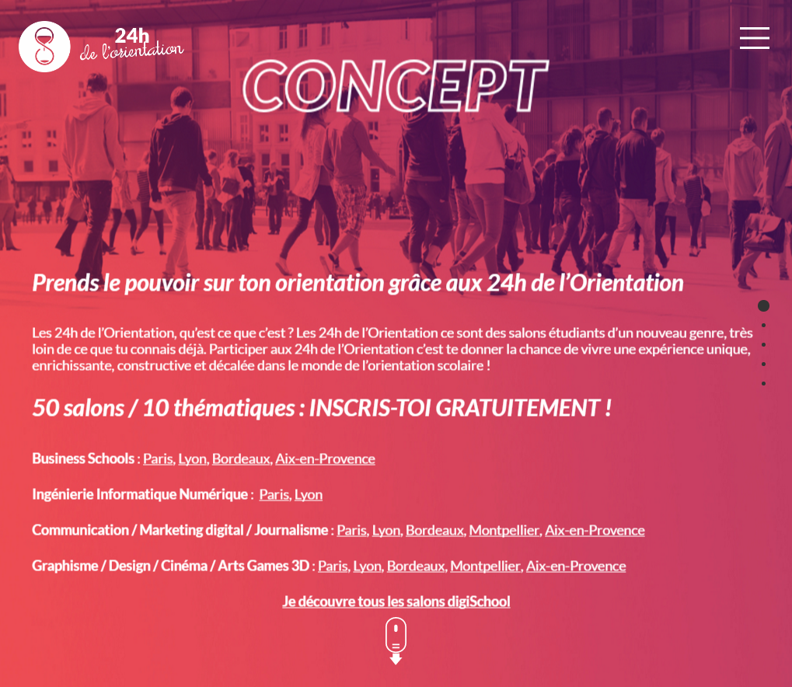

Ce projet est traduit [en français ici](#cahier-des-charges-pour-le-css-zen-garden)

# Technical specifications for the CSS Zen Garden

This is a __school project__ to [@hepl-web](https://github.com/hepl-web). He consist to edit the __CSS__ and don't touch to HTML for see all possibilities wich the CSS have

The original website is here : http://www.csszengarden.com/

My work is here : http://hepl01.cblue.be/~user18/dw/css-zengarden

## Getting Started

* Go to the `content` folder [here](./content)
* See the css zen gaarden : [here](./content/style.css)

## Here are the submission guidelines for the new and improved csszengarden.com

- CSS3? Of course! Prefix for ALL browsers where necessary.
- go responsive; test your layout at multiple screen sizes.
- your browser testing baseline: IE9+, recent Chrome/Firefox/Safari, and iOS/Android.
- Graceful degradation is acceptable, and in fact highly encouraged.
- use classes for styling. Don't use ids.
- web fonts are cool, just make sure you have a license to share the files. Hosted services that are applied via the CSS file (ie. Google Fonts) will work fine, but most that require custom HTML won't. TypeKit is supported, see the readme on this page for usage instructions : https://github.com/mezzoblue/csszengarden.com/

## Fonts used
- `Font Awesome` : for the icons
- `GOOGLE FONTS` : use for obtain right of Fonts
- `Hanalei`      : for the h1 and h2 with Google Fonts
- `Quicksand`    : for the text with Google Fonts

## Colors used
I have use Adobe Color CC online for create [my color pallet](https://color.adobe.com/fr/create/color-wheel/?base=2&rule=Monochromatic&selected=0&name=Mon%20th%C3%A8me%20Color&mode=rgb&rgbvalues=0.14901960784313728,0.2607843137255018,0.5,0.5980392156862746,0.7260379011940105,1,0.2980392156862745,0.5215686274509804,1,0.5781776239907728,0.6263359816486618,0.7294117647058823,0.23843137254901967,0.41725490196080295,0.8&swatchOrder=0,1,2,3,4). And I have used just 4 colors :
1. the black : 
2. the white : 
3. the light blue : 
4. the pastel blue : 

## Graphic univers

I want create an animate page, the navigation page will become interactive and lot of time render him amazing. This concept extremliest here : http://www.csszengarden.com/219/

__Impossible to make :__ because it's in pure CSS. But I can try to make a background animated or a slider image simple... ~~I think begin on a big slider, in pure CSS with animations effects and variate transitions.~~

For this project I will look for higth resolution pictures with a Creative Comon license. __EDIT :__ I have used pictures of : [Pixabay](https://pixabay.com)

## Inspiration

Here are some designs that I appreciate and I want used in this project.

__Impossible to make :__ because it's in pure CSS. ~~The concept of navigation page came of this site : http://24h.orientation.com/concept.html~~

This style of button, I find them nice came of this site : http://converteo.com/

__Impossible to make :__ because it's in pure CSS. But I can try to make a background animated or a slider image simple... ~~If I don't make the big slider system, I can always make a smallest in this style of this site : http://www.liptonicetea.com/~~

I can make on my slider an label system as here, but I will make maybe a system 2x2 in desktop screen : http://www.chassepierre.be

On the same site, the hover button are so original with a border added.

## TODO
- [x] Find some pictures free common for the project.
- [ ] ~~Create the CSS slider system.~~
- [x] Make the template of site.
- [ ] __Not update__

------------------------------------

## Release History
* **2016/11/23 :** `v0.0.1` Pre-release of my project (this is a __BIG commit__)
* **2016/11/01 :** starting project

## Feedback (in french, sorry)
### First return of my teachers
>  On 2016/11/00 : first Feedback

- [ ] Coming Soon

------------------------------------

__Traduction__
==============

# Cahier des charges pour le CSS Zen Garden

C'est un __projet scolaire__ pour la [@hepl-web](https://github.com/hepl-web). Ce projet consiste à éditer le __CSS__ sans toucher au html pour voir toutes les possibilités qu'ont à offrir le CSS.

## Débuter

* Aller dans le dossier `content` : [ici](./content)
* Regarder le code du CSS Zen Garden : [ici](./content/style.css)

## Voici les grandes directives pour la soumission du csszengarden.com
- CSS3 ? Bien entendu ! Ne pas oublier de préfixer pour tous les navigateurs.
- Faire le CSS en responsive et tester le template à de nombreuses résolutions d'écrans différentes.
- Nos test doivent obtenir une rétro-compatibilité à partir d'IE9, ainsi que les versions récentes de Chrome/Firefox/Safari, ainsi que iOS/Android.
- Une dégradation gracieuse est conseillée.
- On doit utiliser les classes CSS pour mettre en style et non les ID CSS.
- Nous devons avoir les droits sur l'utilisation des polices hébergées pour le projet. Les polices Google fonctionnent correctement, cependant les polices TypeKit peuvent être utilisées pour ce projet, les instructions d'utilisation sont disponibles ici : https://github.com/mezzoblue/csszengarden.com/

## Polices utilisées
- `Font Awesome` : Utilisée pour les icones
- `GOOGLE FONTS` : Justiliserai très certainement des polices Google Fonts dans ce projet pour avoir les droits d'utilisation.
- `Hanalei`      : pour les titres h1 et h2 avec Google Fonts
- `Quicksand`    : pour le texte avec Google Fonts

## Couleurs utilisées
J'ai utilisé Adobe Color CC enligne pour créer [ma palette de couleurs](https://color.adobe.com/fr/create/color-wheel/?base=2&rule=Monochromatic&selected=0&name=Mon%20th%C3%A8me%20Color&mode=rgb&rgbvalues=0.14901960784313728,0.2607843137255018,0.5,0.5980392156862746,0.7260379011940105,1,0.2980392156862745,0.5215686274509804,1,0.5781776239907728,0.6263359816486618,0.7294117647058823,0.23843137254901967,0.41725490196080295,0.8&swatchOrder=0,1,2,3,4). And I have used just 4 colors :
1. le noir : 
2. le blanc : 
3. le bleu clair : 
4. le bleu pastel : 

## Univers graphique

Je voudrais créer une page web annimée, je trouve que ça rend le site plus interactif et parfois même on peut rendre la naviguation amusante. Le concept poussé à l'extrème peut donner ce résultat : http://www.csszengarden.com/219/

__Impossible à réaliser :__ parce qu'il faut créer le designe en pure CSS sans modifier le html. Mais je peux essayé de faire une image d'arrière plan annimée ou a slider d'images assez simple et automatique... ~~Je pense partir sur un slider géant, pure CSS bien entendu, avec des effets d'animations et de transitions variées.~~

Pour ce faire je vais chercher des images haute résolution libre de droit sous license Creative Comon. __MÀJ :__ J'ai utilisé des images venant de : [Pixabay](https://pixabay.com)

## inspiration

Voici des design que j'apprécie et que je pense utiliser dans ce projet.

__Impossible à réaliser :__ parce qu'il faut créer le designe en pure CSS sans modifier le html. ~~L'idée de navigation me vient de cette page de ce site : http://24h.orientation.com/concept.html~~

Ces styles de bouton, je les trouve agréable, venant du site : http://converteo.com/

__Impossible à réaliser :__ parce qu'il faut créer le designe en pure CSS sans modifier le html. Mais je peux essayé de faire une image d'arrière plan annimée ou a slider d'images assez simple et automatique... ~~Si je ne fais pas mon système de grand slider, je peux toujours faire un plus petit dans le style de ce site : http://www.liptonicetea.com/~~

Je pourrais faire sur mon slider un système de vignette comme ici, mais je partirais peut être plutôt sur un système 2x2 en version écran de bureau : http://www.chassepierre.be

Sur le même site leur système de bouton hover est assez original avec un encadrement qui y est rajouté.

## Liste de choses à faire
- [x] Touver des images libres de droits pour allimenter le contenu du projet.
- [ ] ~~Créer le système de slider CSS.~~
- [x] Faire la mise en page du site.
- [ ] Créer les animations et transitions pour rendre la page interactive.
- [ ] Adapter la mise en page pour mobile (et écran en-dessous de 950px).
- [ ] Créer une image d'arrière plan annimée ou un slider d'images d'arrière plan assez simple et automatique.
- [ ] Netoyer le fichier css.
- [ ] Lancer autoprefixer voir [le cahier des charges de CSS Zengarden pour la soumission](#voici-les-grandes-directives-pour-la-soumission-du-csszengardencom).

------------------------------------

## Historique des versions
* **2016/11/23 :** `v0.0.1` Pré-version du projet (c'est une __GRANDE modification__)
* **2016/11/01 :** Début du projet

## Feedback (in french, sorry)
### First return of my teachers
>  On 2016/11/00 : first Feedback

- [ ] À venir...
